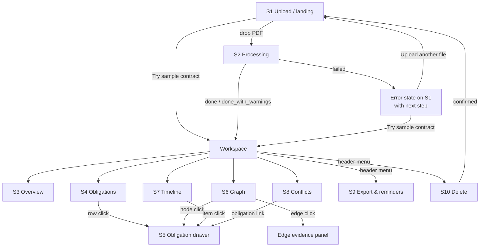
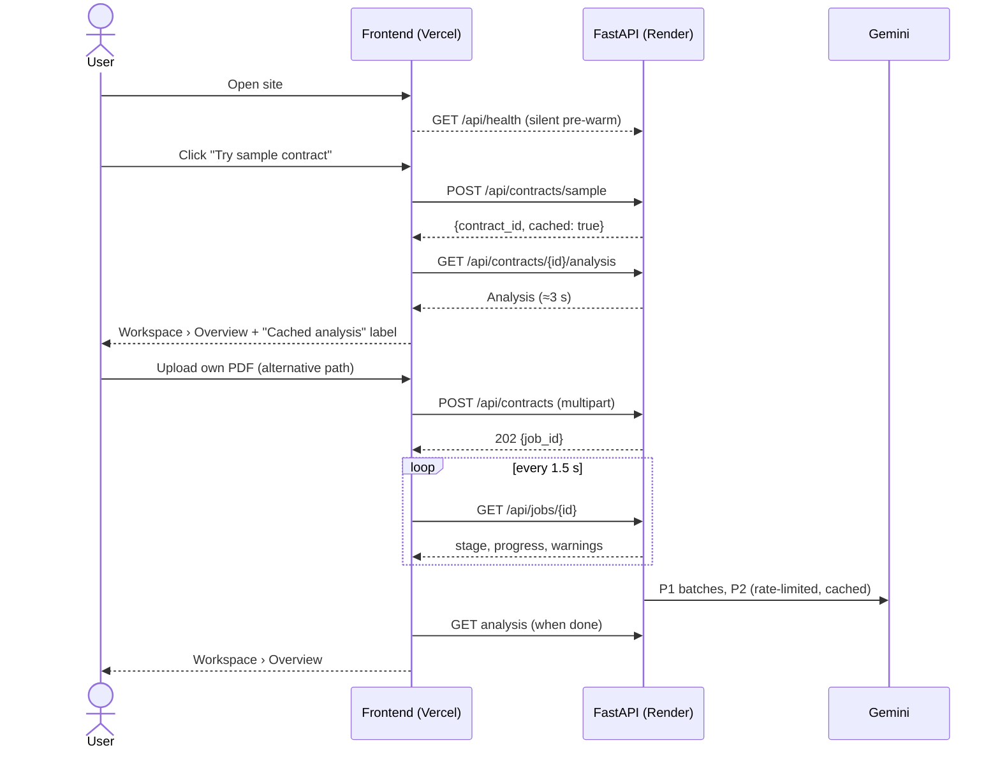
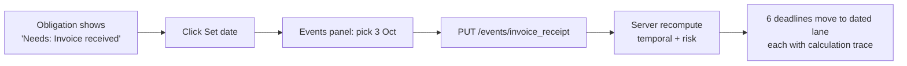
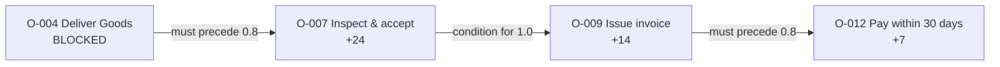
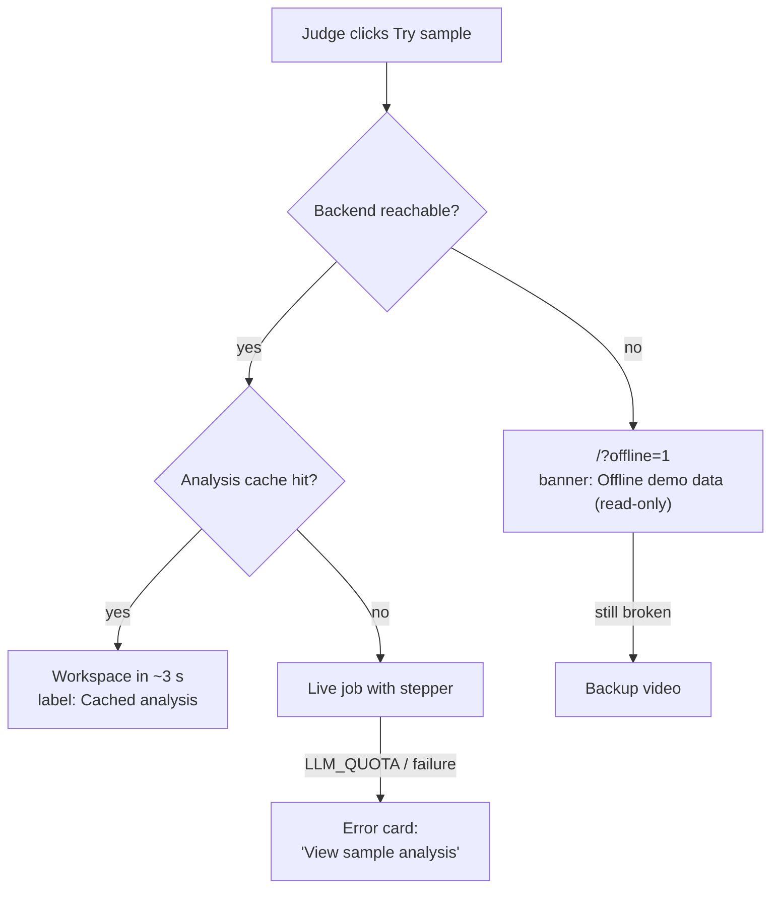

# Conan: App Flow

How a user moves through Conan: screens, navigation, primary flows, states, and the exact copy for key moments.

| | |
|---|---|
| **Related** | [PRD.md](PRD.md) · [TRD.md](TRD.md) |
| **Routes** | `/` Upload · `/c/:contractId` Workspace (tabs) · `/?offline=1` Offline demo |

---

## 1. Screen inventory

| # | Screen / surface | Route | Purpose |
|---|---|---|---|
| S1 | **Upload (landing)** | `/` | Drop a PDF or click **Try sample contract**. Silently pre-warms the backend. |
| S2 | **Processing** | `/` (in place) | Stage stepper with progress, messages and warnings while the analysis job runs |
| S3 | **Workspace › Overview** | `/c/:id#overview` | Parties, counts, upcoming deadlines, unresolved dates, needs-review queue, warnings |
| S4 | **Workspace › Obligations** | `/c/:id#obligations` | Filterable table of obligations with band, due date, status, review state and source |
| S5 | **Obligation drawer** | overlay on S4/S6/S7 | Fields with provenance chips, highlighted evidence, risk breakdown, review actions, status, history |
| S6 | **Workspace › Graph** | `/c/:id#graph` | React Flow dependency graph; edge evidence panel; "Simulate blocked"; "Reviewed links only" toggle |
| S7 | **Workspace › Timeline** | `/c/:id#timeline` | Dated lane plus a "Needs trigger date" lane; events panel for setting trigger dates |
| S8 | **Workspace › Conflicts** | `/c/:id#conflicts` | Potential inconsistencies, with quotes shown side by side |
| S9 | **Export & reminders** | menu in the Workspace header | ICS / CSV download, send a test email, SMS preview (simulated) |
| S10 | **Delete confirmation** | inline panel | Confirm permanent deletion of the contract and all derived data |
| G1 | **Disclaimer banner** | global | "Conan is not legal advice…" (always visible, dismissible per session only) |
| G2 | **Status labels** | global | "Cached analysis", "Offline demo data", "Sample contract" |

## 2. Navigation map

Workspace tabs share one analysis payload. Switching tabs never refetches unless something changed.

## 3. Primary flow: first-time user (or judge, unaided)

**Steps**
1. **S1 Upload.** Headline: *"Turn a contract into a checklist you can trust."* The primary action is a drop zone ("Drop a text-based PDF, up to 10 MB / 30 pages"). The secondary action is the **Try sample contract** button. The disclaimer banner is visible.
2. **Client-side precheck.** The browser checks file type and size before upload and shows errors inline (see §9).
3. **S2 Processing.** The stepper shows `Reading PDF → Finding clauses → Extracting obligations → Checking evidence → Resolving dates → Linking obligations → Checking conflicts → Done`, with a progress bar, the current message (for example "Extracting obligations: batch 2 of 3") and any warnings as they arrive. If the first request takes more than 5 s: *"Waking the server. This takes up to a minute on the free tier."*
4. **Done → S3 Overview.** When the job ends `done_with_warnings`, a yellow notice appears: *"2 clauses could not be analyzed."* with links to those clauses.

## 4. Workspace screens

### 4.1 S3 Overview
- **Header:** contract name, parties (Customer / Supplier), page count, labels (Sample / Cached analysis / Offline demo data).
- **Summary tiles:** Obligations · Needs review · Unresolved dates · High+Critical · Potential conflicts.
- **Upcoming deadlines:** the next 5 resolved deadlines, each with a band pill.
- **Needs trigger date:** events blocking dates, e.g. *"Invoice received: 6 deadlines waiting"*, each with a **Set date** button (opens the events panel, §4.5).
- **Needs review:** unverified and low-confidence obligations first.
- **Coverage note:** *"4 clauses have no obligations"*, linking to those clauses (a transparency guard against omission).

### 4.2 S4 Obligations
- **Columns:**
  - ID
  - Obligation (`Actor must action object`)
  - Category
  - Due, showing either a date or a chip: *Needs: Invoice received* / *Conditional* / *No deadline*
  - Priority band and score
  - Status (open / done / blocked / waived)
  - Review state (proposed / confirmed / edited / rejected)
  - Source (`§6.3 · p. 4`, or `p. 4 (approx.)` if unverified)
- **Filters:** category, party, status, due window (overdue / 7 d / 30 d / later / unresolved), risk band, review state, and a search box.
- **Row click** opens the S5 drawer. Rejected rows are hidden by default ("Show rejected" toggle).

### 4.3 S5 Obligation drawer
Top to bottom:
1. **Title:** "Tarnwick Robotics must pay undisputed invoiced amounts", with band pill and score.
2. **Evidence:** clause text with the quote highlighted, plus `§6.3 · p. 4 · Verified`. If unverified: *"We couldn't find this exact text in the contract. Check it against the source before confirming."*
3. **Fields,** each with a provenance chip (Extracted · Computed · AI-proposed · Reviewed): actor, counterparty, modality, action, object, trigger, deadline rule (the raw text plus its normalized form), due date with its **calculation trace** (e.g. `Invoice received (3 Oct, you set) + 30 calendar days → 2 Nov`), amount, penalty and cross-references.
4. **Priority breakdown:** a table of factor → points, ending in a total that equals the score, with the caption *"Attention priority, not a probability of breach."* The downstream-impact factor lists its path, with each edge's quote and page.
5. **Review actions:** **Confirm** · **Edit** (inline fields, then Save) · **Reject** (optional note).
6. **Status:** Open · Done (asks "Completed on" → date) · Blocked · Waived.
7. **History:** the audit list (action, before → after, time).

### 4.4 S6 Graph
- **Nodes:** obligations, coloured by band. The label is a short action ("Deliver Goods") with the ID. Rejected obligations are hidden.
- **Edges:** solid = confirmed, dashed = AI-proposed. Unverified edges are hidden unless "Show unverified links" is on. The edge label is the relation (must precede / condition for / depends on / may trigger).
- **Toolbar:** **Reviewed links only** (limits propagation to confirmed links) · **Show unverified links** · **Fit view** · band legend.
- **Node click** opens the S5 drawer. **Edge click** opens the edge panel: relation, source (rule / AI), evidence quote with page, confidence, **Confirm link** / **Reject link**.
- **Simulate blocked:** in the drawer, or from a node's context button, marks the obligation blocked. Downstream nodes then pulse and show the badge *"Potential downstream impact +24"*. The node shows **Clear block** to undo.

### 4.5 S7 Timeline and events panel
- **Lane 1 (dated):** items placed on a date axis and coloured by band, with a "today" line (or `DEMO_AS_OF`).
- **Lane 2 ("Needs trigger date"):** items grouped by the missing event.
- **Events panel:** one row per event (Effective date, PO issued, Delivery, Acceptance, Invoice received, …), each with a date picker. Each row shows *"Set by you"*, *"From contract text"* or *"From completion of O-004"*. Setting a date triggers a recompute, and the resolved items animate from lane 2 into lane 1 (motion respects reduced-motion). Clearing a date moves them back.

### 4.6 S8 Conflicts
Each card shows:
- kind (payment term / notice period / amount / date)
- both quotes side by side with their clause and page
- the linked obligations
- a status: Open, Acknowledged or Dismissed

The fixed copy reads: *"These may be inconsistent. Conan does not determine which clause prevails; check the order-of-precedence clause or ask counsel."*

### 4.7 S9 Export and reminders
- **Download calendar (.ics):** resolved deadlines only, with reminders 7 days and 1 day before. The note reads *"Unresolved deadlines are not exported until their trigger date is set."*
- **Download CSV:** all obligations.
- **Send test reminder** (stretch): one email field and a **Send** button. The result says *"Sent to name@example.com"* or gives the error.
- **SMS preview** (stretch): shows the exact message text with the badge **"Simulated, not sent"**.

## 5. Core interaction flows

### 5.1 Resolve deadlines by setting a trigger event

### 5.2 Mark done → completion cascade
Mark O-004 "Supplier delivers Goods" **Done**, completed on 1 Oct. The server sets `delivery = 1 Oct (from completion)`. O-007 "inspect within 5 business days of delivery" resolves to 8 Oct, and the timeline and priorities update.

### 5.3 Blocked upstream → downstream impact (D1)

The user sets O-004 to **Blocked** (or uses Simulate blocked). Downstream nodes gain the factor *"Potential downstream impact via O-004"*, with each edge's quote and page in the drawer. Turning on **Reviewed links only** removes impact carried through unconfirmed links.

### 5.4 Review an AI-proposed link
Edge click → the panel shows the quote *"Upon Acceptance, Supplier may invoice…"* (§6.2 · p. 4) → **Confirm link** → the edge turns solid, and the audit entry is recorded.

### 5.5 Correct an extraction
Drawer → **Edit** → change the offset from 30 to 45 → **Save**. The field chip turns *Reviewed*, the history records before and after, and the date and priority recompute.

### 5.6 Delete
Header menu → **Delete contract** → an inline panel: *"Delete Master Supply Agreement and all extracted data? This can't be undone."* → **Delete permanently** → back to S1 with the toast *"Contract deleted."* (There are no browser dialogs; confirmation happens inside the page.)

## 6. Demo flow (3-minute script mapped to screens)

| Time | Screen | Action | Say |
|---|---|---|---|
| 0:00–0:20 | S1 | Show the landing page | "Missed deadlines don't come from bad intent. They come from clause 6.3 on page 4." |
| 0:20–0:40 | S1 → S3 | **Try sample contract** → Overview | Point at the *Cached analysis* label; 18 obligations, 5 unresolved dates |
| 0:40–1:10 | S5 → S7 | Open the payment obligation; set *Invoice received* | "Conan never guesses a date. You give it the event and it does the arithmetic." |
| 1:10–1:55 | S6 | Mark delivery **Blocked**; open an edge; **Confirm link** | "One delay, three downstream duties at risk, and every link has its evidence." |
| 1:55–2:20 | S8 | Open the §6.3 vs Schedule B conflict | "Conan flags it. It doesn't decide which one wins." |
| 2:20–2:40 | S5 → S9 | Edit a field and confirm; download the ICS | "People stay in control, and the reminders go straight to your calendar." |
| 2:40–3:00 | Any | Close | Pitch, disclaimer, roadmap |

**Before going on stage:** hit `/api/health` 5 minutes before; keep a tab ready at `/?offline=1`; have the backup video ready.

## 7. Fallback flows

- **Offline mode:** the Workspace renders from the bundled fixture. Review, events and export controls are disabled, with the tooltip *"Not available in offline demo."*
- **Restart mid-job:** the stepper just keeps polling; the server requeues the job and replays cached LLM calls.

## 8. States per screen

| Screen | Loading | Empty | Partial / warning | Error |
|---|---|---|---|---|
| S1 | Button spinner on upload | (none) | (none) | Inline file errors (§9) |
| S2 | Stepper with progress | (none) | Warnings listed live | Error card with code-specific message and next step |
| S3 | Skeleton tiles | *"No obligations found. This contract may not contain operational duties, or its text couldn't be read."* + Try sample | Yellow notice: clauses not analyzed | Retry fetch |
| S4 | Skeleton rows | *"No obligations match these filters."* + Clear filters | Unverified rows marked | Retry |
| S6 | Layout spinner | *"No links between obligations yet."* | *"AI link proposals unavailable. Showing rule-based links only."* | Retry |
| S7 | Skeleton lanes | *"No dated deadlines yet. Set a trigger date to resolve them."* | (none) | Retry |
| S8 | Skeleton cards | *"No potential conflicts found."* | (none) | Retry |
| S9 | Button spinner | *"No resolved deadlines to export yet."* | (none) | *"Couldn't send. Check the address and try again in a minute."* |

## 9. Error copy (from API error codes)

| Code | Message | Next step shown |
|---|---|---|
| `NOT_PDF` | "This file isn't a PDF." | Upload a PDF · Try sample contract |
| `TOO_LARGE` | "This PDF is over 10 MB." | Upload a smaller file |
| `TOO_MANY_PAGES` | "This PDF has more than 30 pages. The hackathon build supports up to 30." | Upload a shorter contract |
| `ENCRYPTED` | "This PDF is password-protected." | Remove the password and upload again |
| `NO_TEXT_LAYER` | "This looks like a scanned PDF. Conan needs a text-based PDF." | Try sample contract |
| `LLM_QUOTA` | "The AI service's free quota is used up right now." | View sample analysis · Try again later |
| `LLM_UNAVAILABLE` | "The AI service didn't respond." | Try again |
| `PARTIAL_EXTRACTION` | "Some clauses couldn't be analyzed." | View results · See affected clauses |
| `EMPTY_EXTRACTION` | "No obligations were found in this contract." | View clauses · Try sample contract |
| `INTERNAL` | "Something went wrong on our side." | Try again |

## 10. Global UI rules

- **Disclaimer (G1):** *"Conan helps you review and track contracts. It is not legal advice, can make mistakes, and never decides which clause prevails. Use fictional or public contracts only."*
- **Provenance chips** on every field: **Extracted** (from contract text, with evidence) · **Computed** (by Conan) · **AI-proposed** (unreviewed suggestion) · **Reviewed** (confirmed or edited by a person).
- **Priority bands** always pair colour with text: Low · Medium · High · Critical.
- **Labels (G2)** are never hidden: *Sample contract*, *Cached analysis (generated at HH:MM, pipeline v1)*, *Offline demo data*.
- **Wording:** "potential downstream impact", "may be inconsistent", "attention priority". Never "breach", "invalid", "you should".
- **Accessibility:** every action is reachable by keyboard; focus is visible; the drawer traps focus and closes on Esc; motion respects `prefers-reduced-motion`.
